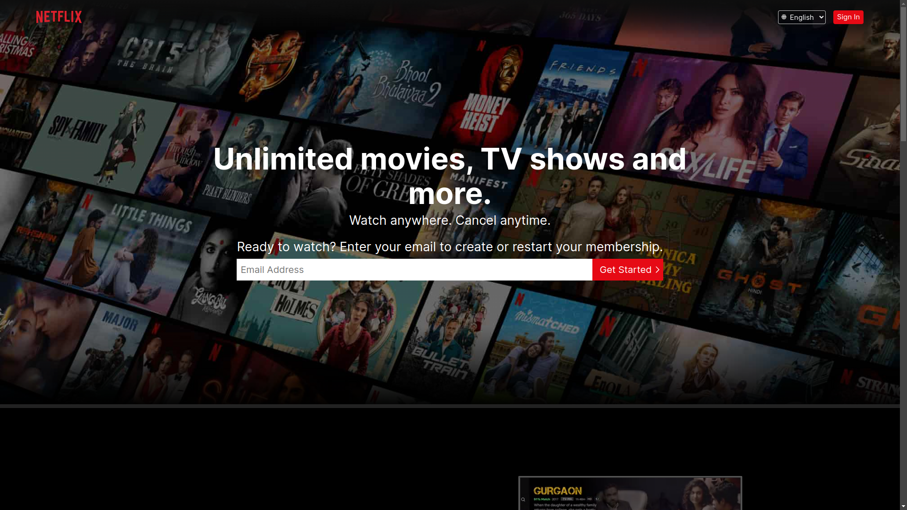
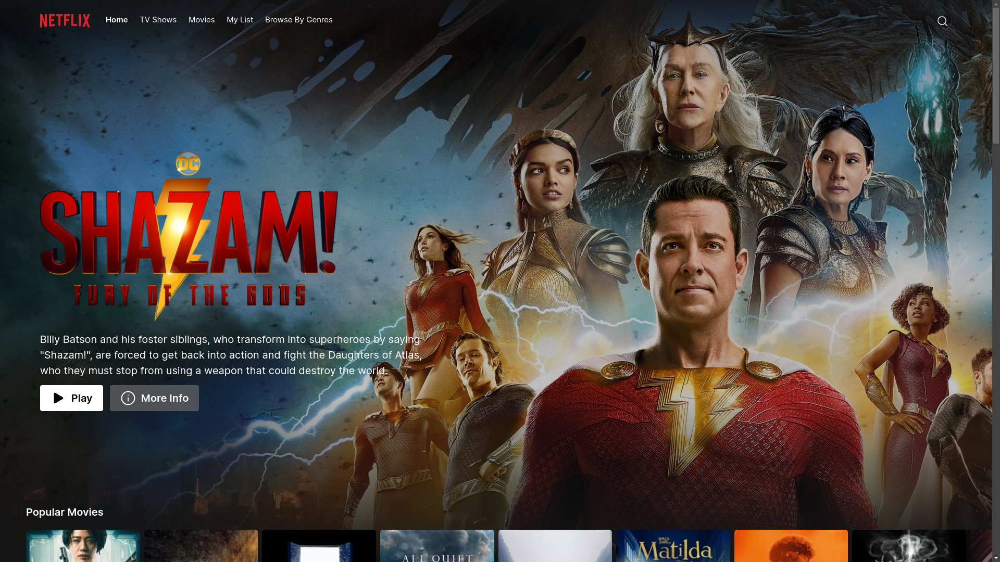
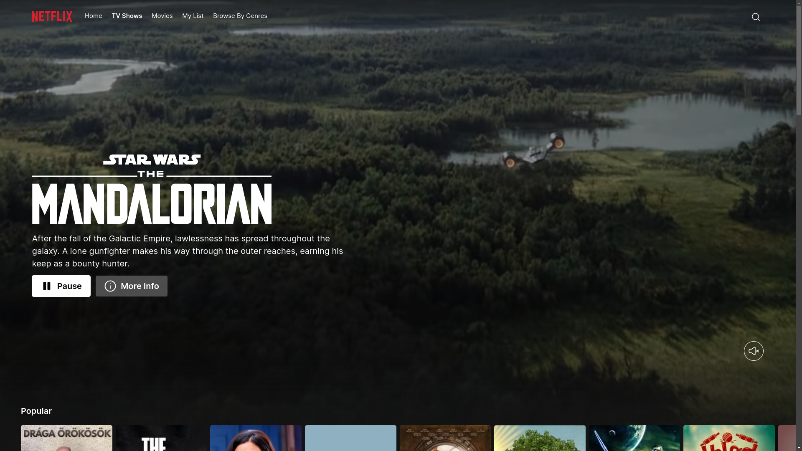
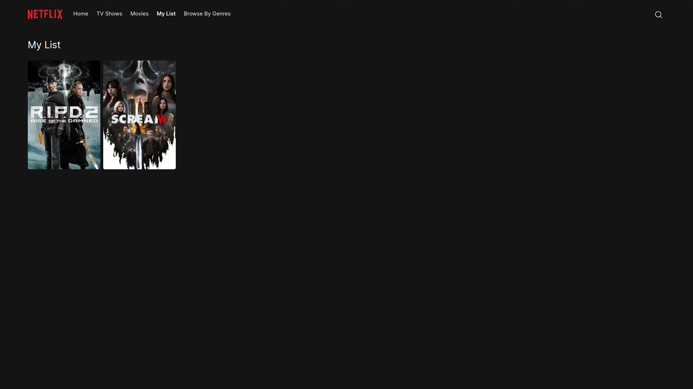
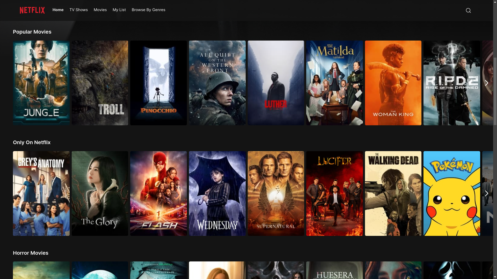
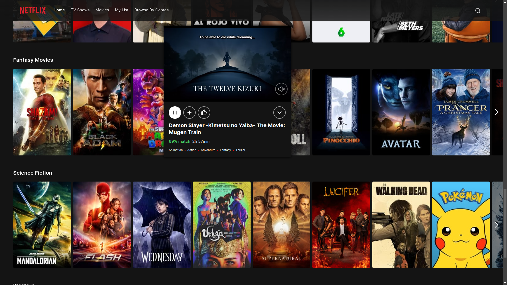
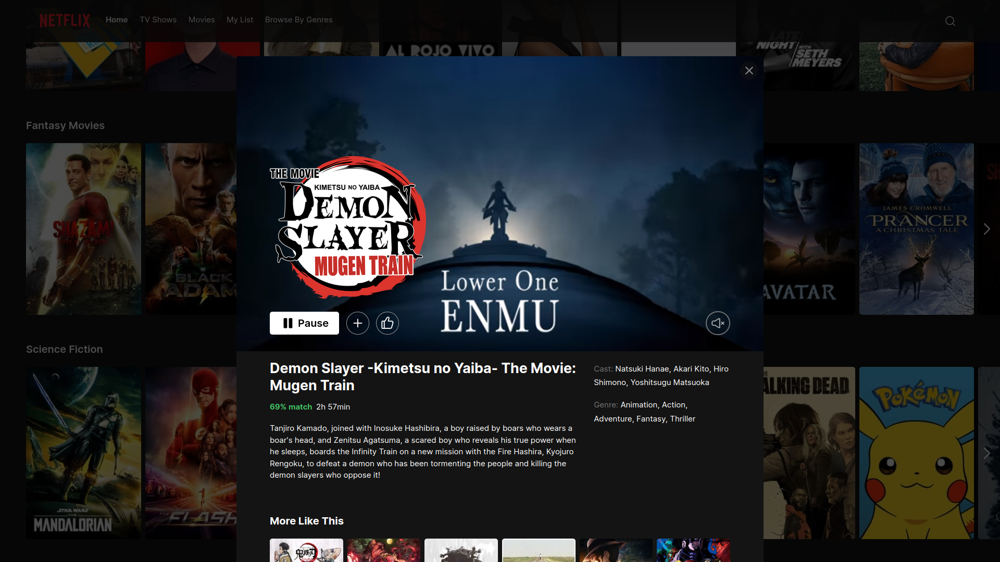

<h1 align="center">Netflix Clone</h1>

## Screenshots



> Home Page

---




> Browse Page

---



> My List Page

---




> Clickable List Sliders (with small info modal)

---



> Big Info Modal

---

## Demo


https://user-images.githubusercontent.com/51372520/226106224-e8b3e8de-ea96-4f84-9cbf-da96142faef6.mp4


> Desktop Demo

---


https://user-images.githubusercontent.com/51372520/226106086-2d7e4865-42ee-4771-a785-ea5d0b1068cc.mp4


> Mobile Demo

---

## Stack Used

- [Typescript](https://www.typescriptlang.org/)
- [React](https://react.dev)
- [SCSS Modules](https://github.com/css-modules/css-modules)
- [TMDB API](https://www.themoviedb.org/documentation/api)
- [Framer Motion](https://www.framer.com/motion/)
- [Iconoir Icons](https://iconoir.com/)
- [Vercel](https://vercel.com)

## Run Locally

1. First clone the project:

```bash
git clone https://github.com/schardev/nfx
```

2. Go to project directory and install packages:

```bash
cd nfx && pnpm install
```

3. Create `.env.local` file and paste your [TMDB API](https://developers.themoviedb.org/3) key:

```
VITE_TMDB_API=<paste your api key here>
```

4. Now start the application:

```bash
pnpm run dev
```
